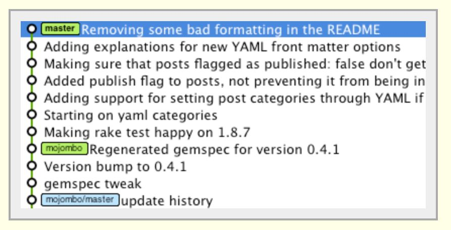

# Team Workflow with Git and GitHub

Although up until now we've been using Git only to manage our own projects, it
was actually designed as a tool for _teams_ to use, so that they could
collaborate more effectively. Since you're much more likely to be working on a
development team than working individually, it's important to know how to use
Git in a team setting.

Specific Git workflows will vary from team to team, but most are built around
feature branching, the practice of using separate Git branches to isolate
different features of an application while they're under development. Though
this is useful even in the context of working individually, since it
allows you to easily switch which part of the application you're working on,
where this approach really shines is in a team setting.

By splitting up features over multiple different branches, team members can
work in parallel on different parts of an application without stepping on each
others' toes. There are three core mechanics within Git that a feature
branching strategy depends on. Two of them, branching and merging, you've
already seen. Today, we'll introduce a third: _rebasing_.

## Prerequisites

- Basic Git workflow
- Git Branching and Merging

If you're feeling fuzzy on these topics, here's some reading to brush up.

1. [Atlassian Tutorials: Using Branches](https://www.atlassian.com/git/tutorials/using-branches)
1. [Atlassian Tutorials: Comparing Workflows](https://www.atlassian.com/git/tutorials/comparing-workflows)
1. [Atlassian Tutorials: Merging vs Rebasing](https://www.atlassian.com/git/tutorials/merging-vs-rebasing)
   ('Conceptual Overview' section only)

## Objectives

- Combine changes from one branch with another using `git merge`.
- Combine changes from one branch with another using `git rebase`.
- In squads, work through our recommended Git workflow to build a small project.

## Preparation

**Note: The setup for this lesson is not the same as other repos.**

1. Fork and clone this repository.
1. Run `git checkout solution` so the solution branch is available for a rebase lab.
1. Run `git checkout master`.

### Git Rebase, in Pictures

Suppose that (in addition to master) you have two branches in your project,
`dev` and `feature`, and that the `feature` branch is currently checked
out.

If you were to check out the `dev` branch and make a new commit, the
`feature` branch would no longer point to the end of the `dev` branch.

How could we update our `feature` branch to incorporate the new change?
One option might be to check out the `feature` branch and merge in
`dev`. A merge applies commits from another branch on top of any
commits you've made.

However, this is a little weird - we're essentially creating a duplicate
commit. What's more, the commit on `dev` might not be related to
`feature`, so it may not make sense for it to be on the `feature` branch.

Rebase essentially allows us to pluck off an entire branch and move it so that
it points to a different commit. All we need to do is check out the `feature`
branch (`git checkout feature`) and run the command `git rebase dev`;
now, the root of the `feature` branch points to the new end of the
`dev` branch

That's the end result of a rebase, but rebase doesn't just "move" commits - in
making the move, Git actually destroys the old commits and replaces them with
new commits (with new and different SHAs).

This is one of the things that can make `git rebase` dangerous, and it's the
reason why you never rebase code that's already been published and shared - you
run the risk of breaking other peoples' code.

However, as long as you're only rebasing your own code on top of things,
`git rebase` is perfectly safe, and if `master` happens to change a lot,
it's a great way of making sure that `feature` stays up to date.
_Remember: when you "rebase your code on top of things" the branch following
`git rebase` is what you're rebasing your branch "on top of" — it will be the
new "base" for your current branch if executed._

Note that you can configure your Git installation to automatically rebase when
you run `git pull` -- normally, pulling from a remote creates a merge commit.
Configuring Git for a rebase allows you to stay up to date with a remote without littering
your commit history with merges. If you don't have Git set up that way, you have to run
`git pull --rebase` to get the same behavior (more on this configuration option [here](http://gitready.com/advanced/2009/02/11/pull-with-rebase.html)).

### Discussion: The Team Project Workflow

Though there are a lot of different potential Git workflows for teams, for your
team project, we will require you to use the following workflow.

#### Setup (Do once, on only ONE computer)

1. Create a GitHub Organization for your repos, and add collaborators as members
   of the organization. Their role must be set to **Owner**. To confirm that
   they have joined as owners, go to the "People" tab on your organization. If
   you need to change someone's role, you can do so by clicking the gear icon.
   Any repos that you create as part of the project will go inside this
   organization. Make sure you create the organization on GitHub and not GitHub
   Enterprise.

1. Create an empty starting repo within the new GitHub organization. (If you were
   working on an existing repo such as for homework, you'd fork it).

1. Using `git remote add origin <your-ssh-git-url>` attach your two GitHub
   repos to the corresponding ones on your local computer (one for React containing your
   front end app and another for Express containing your API server).

1. Create a `development` branch in each repo and push them up to the remotes
   on GitHub.

1. Have each member of the team clone, **NOT FORK**, both repos, so that they
   have their own copies of each.

#### Regular Workflow

On a day-to-day basis, your team will follow a feature branching workflow. Each
time you want to create a new feature for your app, you'll go through the
following stages.

##### Creating a New Feature Branch

1. Check out your `development` branch (`git checkout development`)

1. Ensure that `development` is up to date with the `development` branch on
   GitHub by running `git pull origin development`.

1. Create and check out a new feature branch using `git checkout -b my-feature-branch`

##### Integrating a Feature

1. After you're done working on the branch, check in with your team and let them
   know that you're ready to integrate your feature.

1. Because `development` may have been updated in the time since the feature
   branch was created, it's important to make sure that the new feature doesn't
   conflict with anything. Run `git checkout development` and `git pull origin development` to make sure that your `development` branch incorporates any
   updates that were made on the repo on GitHub. Then, run `git checkout my-feature-branch` and `git rebase development` to rebase your new feature on
   top of the (updated) `development` branch.

1. If any conflicts were introduced in the previous step,
   work through the code **with your team** and resolve each one;
   when you finish, make a commit.

1. Now that your branch has been rebased, and you're ready to integrate it,
   push your branch up to GitHub with `git push origin my-feature-branch`
   and then create a pull request (within your GitHub repo)
   from your feature branch to the `development` branch.

1. As a team, review the pull request, confirm whether or not
   it can be merged in automatically, and decide whether or not
   to approve the pull request.

   If there are merge conflicts preventing an automatic merge,
   a member of your team will need to resolve those conflicts manually
   on their machine, and then push the newly updated `development` branch
   back up to GitHub.

Once `development` has been updated, other members of the team
will need to rebase their own feature branches on it (as described in Step 2)
before they push up those feature branches up to GitHub.

What if you want to know about remote branches, such as a feature branch that
someone else is working on? You might want to pull down a feature branch to
test it locally, for example.

Each team member can learn about what exists on the remote. This can be done
with `git fetch origin`. Then, your local git knows about remote branches that
may not have existed when you first cloned the repo.
`git checkout <some-new-branch>` will now be set up as a new branch that tracks
the remote feature branch. Without the fetch, the local git will not know
anything about origin's branches.

##### Deploying a Working App

Work through the following steps as a team.

1. Have one member of the team check out `development`
   and pull down the latest version from GitHub.

1. For this version, check and make sure that the application is working.
   If you have tests, run them.

1. When you're satisfied that the app is ready to deploy,
   check out the `master` branch and run `git merge development`.

1. Push the finished version of your code up to GitHub
   (`git push origin master`).

1. Deploy!

### Git Log Aesthetic

Terse, not neccesarily complete sentences.

### That'll Fix it!

The least elegant way, but will get you out of a jam.

### Project Workflow Visual Recap

These images may help you understand and remember the procedure described above:

#### Pull Development Branch

#### Create a Feature Branch

#### Complete a Feature

#### Update Development

#### Rebase Active Feature Branch

## Code-Along: Fixing a Merge Conflict

Merge conflicts happen, they sound scary but aren't the end of the world. In
fact they have never been easier to manage. Let's take a look at one together.

1. Make your changes locally
   - Create a file called `conflict.md` and add something to it.
   - Now add and commit the file.
1. Rebase on to another branch
   - We will attempt to rebase master off of the solution branch with
     `git rebase solution` solution
   - Uh-oh, looks like there was already a file with that name on the solution
     branch and git doesn't know which file to use. Let's take a look at the
     file in VS Code.
1. Review the merge conflict
   - Notice the file shows you what text is different, which version of the
     file the text comes from, and also provides you with an easy interface to
     choose which text you want.
   - Git places merge markers in the file to define where one version of a file
     starts and ends, and where the other conflicting version starts and ends.
     Luckily, VS Code abstracts away the complexity of dealing with merge markers.
     We just need to choose using a nice GUI button which version to use.
1. Complete the merge
   - Let's pick the text we want in VS Code.
   - Now head back to the terminal.
   - Notice the terminal is giving us some tips on what we should do next:
   - We need to add the change (`git add conflict.md`) and then following the
     instructions, type `git rebase --continue`
1. Ensure you are where you want to be
   - Type `git status`. Also verify the file you merged looks how you want it.
   - Does everything look good? If you are still in the state of rebasing, your
     terminal will tell you that you are in the middle of a rebase. You have
     the choice of a few different options on how to proceed:
     `git rebase --continue | --skip | --abort | --quit | --edit-todo`
     (view more info on these using `git rebase --help`)

##### GENERAL GUIDELINES

- **Always** branch by feature. Each branch should have a feature in mind, i.e.
  auth, book-single, book-collection, etc..., and that feature should be
  completed fully before it's merged into development.

- **Always** pull before a merge or rebase.

- **Never** work directly on either `development` or `master`.

- **Never** share feature branches;
  if you need two people to work on the same feature,
  they should pair program on the same machine.

- **Never _ever_** rebase code that's been published.

### Lab: Identify the differences between rebase and merge

- Open [Explain Git with D3](https://onlywei.github.io/explain-git-with-d3/) in
  your browser.
- This is a very simple git model, and it assumes that every commit already has changes that have been added and saved. Using the `git checkout`, `git commit` (every git commit will generate and place a new commit on the current branch), `git merge`, and `git rebase` commands, and the provided examples for [rebasing](https://onlywei.github.io/explain-git-with-d3/#rebase) and [merging](https://onlywei.github.io/explain-git-with-d3/#merge), run the commands for both merging and rebasing and take note of the differences you find.
- Try replicating the workflow we've laid out for you above that you will use during team workflow:

1. Check out your development branch (`git checkout dev`)
2. Normally, you first ensure that development is up to date with the development branch on GitHub by running `git pull origin dev`. **Note: This command will fail because D3 does not support it.**
3. Now, simulate some work on development:
   1. `git commit`
   2. `git commit`
4. Create and check out a new feature branch using `git checkout -b my-feature-branch`

5. Now, simulate work on feature branch:
   1. `git commit`
   2. `git commit`
6. Next, go back to development branch and simulate more work done that is NOT on your feature branch:
   1. `git checkout dev`
   1. `git commit`
7. Now go back to your feature branch
   1. How do you incorporate the new changes in development?
   2. Should you rebase or merge? Why? Try one, and then simulate the above workflow again, and try the other.
8. Pay special attention to the following:
   - In plain English, what does git merge do to our history?
   - In plain English, what does git rebase do to our history?

_Run through these exercises and discuss insights among
your squads._

## Additional Resources

- [Rebase under the hood](https://git.generalassemb.ly/storage/user/5696/files/e8d0c2ea-4d08-11e7-8844-61fda667d901)
- [Git Branches in a Nutshell](http://git-scm.com/book/en/v2/Git-Branching-Branches-in-a-Nutshell)
- [Distributed Git Workflows](http://git-scm.com/book/en/v2/Distributed-Git-Distributed-Workflows)
- [Learning git visually](https://onlywei.github.io/explain-git-with-d3/)

## [License](LICENSE)

1. All content is licensed under a CC­BY­NC­SA 4.0 license.
1. All software code is licensed under GNU GPLv3. For commercial use or
   alternative licensing, please contact legal@ga.co.
